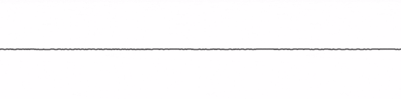

# oscilloscope
[](https://npm.im/oscilloscope)


[](https://mvr.mit-license.org)

Waveform audio visualizer for the HTML5 canvas.



## install
Import the module and bundle it for the browser with your favorite module bundler,
```
$ npm install oscilloscope
```

or include it directly in your HTML:
```html
<script src="//unpkg.com/oscilloscope@1.1.0/dist/oscilloscope.min.js"></script>
```

## example
```javascript
var Oscilloscope = require('oscilloscope')

var audioContext = new window.AudioContext()

// create source from html5 audio element
var source = audioContext.createMediaElementSource(audioElement)

// attach oscilloscope
var scope = new Oscilloscope(source)

// start default animation loop
scope.animate(canvas.getContext("2d"))
```

See the [examples](examples) folder for more details on how to customize the animation.

## usage
### `scope = new Oscilloscope(source [, { fftSize: 2048 }])`
Supply an [AudioNode](https://developer.mozilla.org/en-US/docs/Web/API/AudioNode) as `source`.

Optionally set the `fftSize` property of the internal [AnalyzerNode](https://developer.mozilla.org/en-US/docs/Web/API/AnalyserNode/fftSize). For more control supply an AnalyzerNode as `source`.

#### `scope.draw(context [, x, y, width, height])`
Draw oscilloscope to a canvas `context`, and optionally set position and dimensions.

#### `scope.animate(context [, x, y, width, height])`
Start a basic animation loop that redraws the oscilloscope using the `.draw()` method.

#### `scope.stop()`
Stop the animation loop started by the `.animate()` method.
